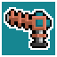
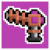

### @flyoutOnly true
### @hideIteration false
### @explicitHints true

# Boss Cannon Sequence

## Step 1
# Cannons

The Time Agents are underneath the Time Orb! They've used their powers to create protective colored rings around it! Use the `activate_cannon()` function to activate the colored cannons in the same order as the colored rings to disable the Time Orb! 

The `activate_cannon()` function takes one parameter that defines what color cannon you want to activate.

Valid colors are:
- `blue` 
- `yellow` 
- `magenta` 
- `green` 

```python
# CODE EXAMPLE - YOU CAN NOT EDIT HERE
# RUN IT TO SEE WHAT HAPPENS

# activate the blue and yellow 
# cannons in that order

activate_cannon("blue")
activate_cannon("yellow")
```

---

## Step 2
# Activity:

There seems to be an order to these colored rings surrounding the Time Orb! From the largest ring to the smallest, write a program that will activate the correct colored cannons to fire at the colored rings to disable the Time Orb! 

The included code below is broken. Can you fix it? Run the code to see what happens, then debug it by editing it to the correct solution.

```python
# code here

activate_cannon("blue")
activate_cannon("magenta")
```

---

