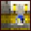

### @flyoutOnly true
### @hideIteration false
### @explicitHints true

# Scene5

## Step 1
# Agent Training

The time agents have now mastered all the important principles! The final step is to position them correctly so they can teach the main AI everything they've learned!

The four functions you'll use to move the time agents are:
- `match_blue_agent()`

- `match_green_agent()`

- `match_yellow_agent()`

- `match_red_agent()`


Each of those functions take a single parameter that represents their destination.

Valid destinations are: 
- `1` 
- `2` 
- `3` 
- `4` 


---

## Step 2
# Activity:

Match the Agents with the training locations that contain the principle they represent.

```python
# code here

match_blue_agent(1)
match_green_agent(2)
match_yellow_agent(3)
match_red_agent(4)
```

---

